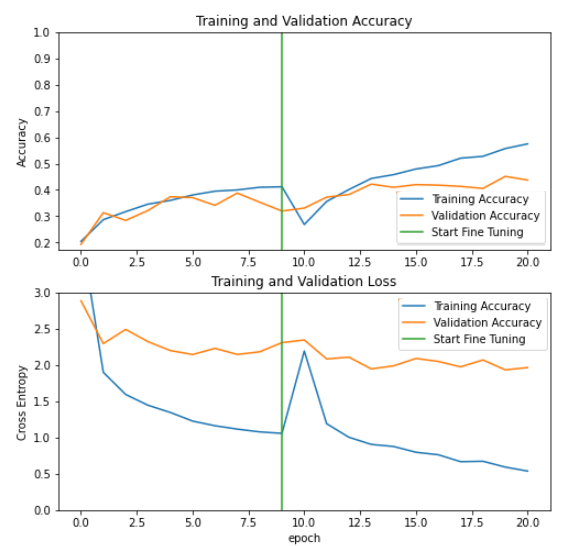
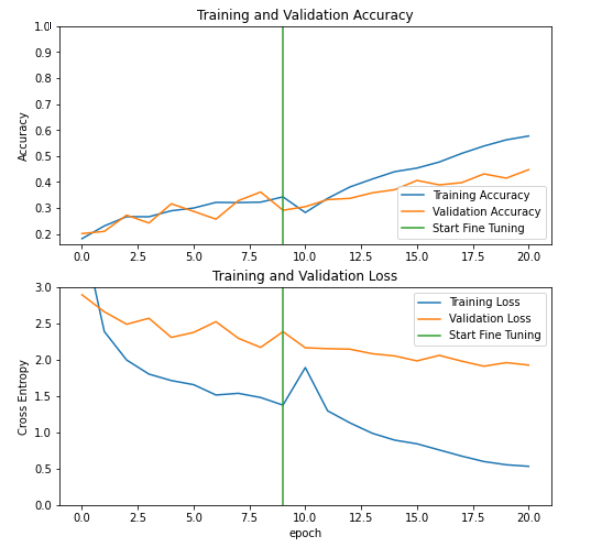

# Clothing Articles Classification

## Introduction
In this repository I introduce a clothes classifier that classifies 46 different types of clothes, the classifier is built using tensorflow framework.

## Dataset
[DeepFashion](https://mmlab.ie.cuhk.edu.hk/projects/DeepFashion.html) is a dataset containing around 800K diverse fashion images with their rich annotations (46 categories, 1,000 descriptive attributes, bounding boxes and landmark information) ranging from well-posed product images to real-world-like consumer photos, for this task I used the Category and Attribute Prediction Benchmark subset which contains 289,222 clothes images from 46 different categories.

## Approach
### Data Handling
1) For this task, I used only 10% of the dataset (28,922 images only) due to the limited GPU capability, then I splitted the dataset into two train and test, 90% and 10% respectively.
2) Due to the huge class imbalance, I used class weighting in my training, to give a higher weight for the classes with low number of samples.
3) Added some data augmentation such as rotation, shifting and flipping.
4) The image size used is 224x224x3, and batch size is 32.

### Modeling
1) I used a pretrained model instead of training a new model from the start to decrease the training time.
2) The pretrained model is used as a feature extractor and then I added a dense layer with number of neurons equal to the number of categories in the dataset.
3) For this task, I tried two small pretrained models (MobileNetv2 and NasNetMobile) to address the problem of size and number of computations.

### Training
1) The feature extractor is frozen for 10 epochs where the dense layer is the only trainable layer.
2) After those 10 epochs the first 2/3 of the feature extractor are kept frozen (because they contain general features) and the rest of the network is fine-tuned for 10 more epochs and the learning rate is divided by 10 to take small steps.

### Evaluation
1) The model is evaluated on the test set, a classification report is generated to show the precision and recall for each class, along with the top-1 and top-5 accuracy.
*The top-5 accuracy is used because there are a lot of categories in the dataset and some of them are quite similar.

### Receptive Field Computation
Used an open source [repository](https://github.com/google-research/receptive_field) for computing the receptive field.
There was an issue in computing the receptive field of MobileNetV2 because of the depthwise conv layers but I found a fix for it in a [closed PR](https://github.com/google-research/receptive_field/pull/11).

There are serveral ways for increasing the receptive field:
1) Using dilated convolutions which increase the receptive field exponentially. 
2) Using pooling.
3) Using strided convolutions.
4) Using transformers, as they use the self attention mechanism which allows each output node to capture the entire receptive field of the input images.

### FLOPs/MACCs Computation
I have implemented my own function for computing the FLOPs and MACCs for the convolution (supports Conv2D, DepthwiseConv2D and SeparableConv2D) and fully connected layers.
FLOPs can be decreased efficiently by applying structured pruning to the trained model, and then fine-tuning for a number of epochs.
[Pruning Example](https://pytorch.org/tutorials/intermediate/pruning_tutorial.html)
## Results

### MobileNetv2
#### Training Curves

#### Classification Metrics

After the training the fully connected layer:

       class        precision    recall  f1-score   support
       
      Anorak            0.00      0.00      0.00         2
      Blazer            0.19      0.47      0.27        73
      Blouse            0.38      0.27      0.31       258
      Bomber            0.09      0.25      0.13         4
    Button-Down         0.00      0.00      0.00         2
      Caftan            0.00      0.00      0.00         2
      Capris            0.00      0.00      0.00         1
    Cardigan            0.36      0.21      0.27       127
      Chinos            0.17      0.33      0.22         3
        Coat            0.17      0.07      0.10        29
     Coverup            0.00      0.00      0.00         0
    Culottes            0.05      0.67      0.09         6
     Cutoffs            0.18      0.56      0.27        18
       Dress            0.90      0.30      0.45       688
     Flannel            0.20      0.40      0.27         5
     Gauchos            0.00      0.00      0.00         0
      Halter            0.00      0.00      0.00         0
      Henley            0.04      0.22      0.07         9
      Hoodie            0.21      0.38      0.27        48
      Jacket            0.38      0.11      0.17       103
       Jeans            0.59      0.52      0.55        63
    Jeggings            0.08      0.50      0.14         4
      Jersey            0.00      0.00      0.00         5
    Jodhpurs            0.00      0.00      0.00         0
     Joggers            0.32      0.28      0.30        43
    Jumpsuit            0.14      0.66      0.23        50
      Kaftan            0.00      0.50      0.01         2
      Kimono            0.14      0.53      0.22        15
    Leggings            0.59      0.37      0.45        60
      Onesie            0.00      0.00      0.00         1
       Parka            0.11      0.71      0.19         7
     Peacoat            0.33      0.50      0.40         2
      Poncho            0.50      0.17      0.25         6
        Robe            0.20      0.33      0.25         3
      Romper            0.28      0.42      0.34        86
      Sarong            0.00      0.00      0.00         0
      Shorts            0.57      0.23      0.33       197
       Skirt            0.55      0.37      0.44       152
     Sweater            0.50      0.20      0.29       128
    Sweatpants          0.22      0.30      0.25        30
    Sweatshorts         0.02      0.33      0.04         6
        Tank            0.51      0.47      0.49       189
        Tee             0.77      0.34      0.47       352
        Top             0.12      0.20      0.15       108
        Trunks          0.06      0.50      0.11         4
    Turtleneck          0.00      0.00      0.00         2

    micro avg           0.32      0.32      0.32      2893
    macro avg           0.22      0.28      0.19      2893
    weighted avg        0.56      0.32      0.37      2893
    
Top 1 Accuracy: 32%  
Top 5 Accuracy: 78%

After fine-tuning:

       class        precision    recall  f1-score   support
       
      Anorak            0.00      0.00      0.00         2
      Blazer            0.35      0.45      0.40        73
      Blouse            0.47      0.25      0.33       258
      Bomber            0.00      0.00      0.00         4
    Button-Down         0.09      0.50      0.15         2
      Caftan            0.00      0.00      0.00         2
      Capris            0.50      1.00      0.67         1
    Cardigan            0.39      0.38      0.38       127
      Chinos            0.10      0.33      0.15         3
        Coat            0.22      0.41      0.29        29
     Coverup            0.00      0.00      0.00         0
    Culottes            0.20      0.17      0.18         6
     Cutoffs            0.15      0.39      0.22        18
       Dress            0.88      0.52      0.66       686
     Flannel            0.11      0.40      0.17         5
     Gauchos            0.00      0.00      0.00         0
      Halter            0.00      0.00      0.00         0
      Henley            0.07      0.22      0.11         9
      Hoodie            0.24      0.27      0.25        48
      Jacket            0.42      0.35      0.38       103
       Jeans            0.42      0.73      0.53        63
    Jeggings            0.00      0.00      0.00         4
      Jersey            0.00      0.00      0.00         5
    Jodhpurs            0.00      0.00      0.00         0
     Joggers            0.27      0.49      0.35        43
    Jumpsuit            0.17      0.52      0.26        50
      Kaftan            0.33      0.50      0.40         2
      Kimono            0.12      0.56      0.20        16
    Leggings            0.59      0.63      0.61        60
      Onesie            0.00      0.00      0.00         1
       Parka            0.29      0.71      0.42         7
     Peacoat            0.17      0.50      0.25         2
      Poncho            0.04      0.17      0.06         6
        Robe            0.25      0.33      0.29         3
      Romper            0.33      0.60      0.42        86
      Sarong            0.00      0.00      0.00         0
      Shorts            0.49      0.43      0.46       198
       Skirt            0.55      0.61      0.58       152
     Sweater            0.48      0.39      0.43       128
    Sweatpants          0.33      0.30      0.32        30
    Sweatshorts         0.15      0.50      0.23         6
        Tank            0.53      0.58      0.55       189
         Tee            0.65      0.54      0.59       352
         Top            0.17      0.09      0.12       108
      Trunks            0.10      0.50      0.16         4
    Turtleneck          0.00      0.00      0.00         2
        
    micro avg           0.46      0.46      0.46      2893
    macro avg           0.23      0.33      0.25      2893
    weighted avg        0.55      0.46      0.48      2893

Top 1 Accuracy: 46%  
Top 5 Accuracy: 85%
#### Receptive Field
The receptive field is 491x491. each output cell can capture a windows of 491x491.
##### Increasing the receptive field
By just adding a single max pooling layer followed by a 3x3 conv layer the receptive field increases from 491x491 to 651x651.
##### Decreasing the receptive field
By removing the last 6 blocks of the model the receptive field decreases from 491x491 to 203x203.
#### FLOPs
##### Top 10 layers  
	Layer                                           FLOPs(M)    	MACCs(M)
	            
    Conv_1	                                        40.203520	    20.133120
    block_1_expand	                                39.739392	    20.471808
    block_16_project	                            30.121280	    15.068480
    block_3_expand	                                22.127616	    11.289600
    block_2_expand	                                22.127616	    11.289600
    Conv1	                                        22.077440	    11.239424
    block_11_expand	                                21.788928	    10.950912
    block_12_expand	                                21.788928	    10.950912
    block_13_expand	                                21.788928	    10.950912
    block_2_project	                                21.751296	    10.913280
* The layer with the highest FLOPs is the last conv layer because it has 1280 kernels.

Total FLOPs ≈ 605M     
Total MACCs ≈ 306M 

### NasNetMobile
#### Training Curves

#### Classification Metrics

After the training the fully connected layer:

       class        precision    recall  f1-score   support
       
      Anorak            0.00      0.00      0.00         2
      Blazer            0.30      0.44      0.35        73
      Blouse            0.33      0.14      0.20       258
      Bomber            0.00      0.00      0.00         4
    Button-Down         0.00      0.00      0.00         2
      Caftan            0.00      0.00      0.00         2
      Capris            0.00      0.00      0.00         1
    Cardigan            0.43      0.14      0.21       127
      Chinos            0.08      0.67      0.14         3
        Coat            0.24      0.14      0.17        29
     Coverup            0.00      0.00      0.00         0
    Culottes            0.18      0.33      0.24         6
     Cutoffs            0.11      0.56      0.19        18
       Dress            0.89      0.31      0.45       687
     Flannel            0.50      0.40      0.44         5
     Gauchos            0.00      0.00      0.00         0
      Halter            0.00      0.00      0.00         0
      Henley            0.11      0.11      0.11         9
      Hoodie            0.16      0.54      0.25        48
      Jacket            0.48      0.40      0.44       103
       Jeans            0.69      0.40      0.51        63
    Jeggings            0.06      0.25      0.10         4
      Jersey            0.00      0.00      0.00         5
    Jodhpurs            0.00      0.00      0.00         0
     Joggers            0.18      0.12      0.14        42
    Jumpsuit            0.17      0.62      0.27        50
      Kaftan            0.10      0.50      0.17         2
      Kimono            0.10      0.53      0.17        15
    Leggings            0.54      0.37      0.44        60
      Onesie            0.00      0.00      0.00         1
       Parka            0.00      0.00      0.00         7
     Peacoat            0.40      1.00      0.57         2
      Poncho            0.29      0.33      0.31         6
        Robe            0.02      1.00      0.03         3
      Romper            0.20      0.47      0.28        86
      Sarong            0.00      0.00      0.00         0
      Shorts            0.64      0.15      0.24       198
       Skirt            0.43      0.35      0.38       152
     Sweater            0.36      0.28      0.31       128
    Sweatpants          0.25      0.33      0.29        30
    Sweatshorts         0.06      0.33      0.11         6
        Tank            0.44      0.49      0.46       189
         Tee            0.70      0.43      0.53       352
         Top            0.08      0.05      0.06       109
      Trunks            0.08      1.00      0.14         4
    Turtleneck          0.01      0.50      0.02         2
        
    accuracy                                0.31      2893
    macro avg           0.21      0.30      0.19      2893
    weighted avg        0.53      0.31      0.36      2893

Top 1 Accuracy: 31%  
Top 5 Accuracy: 75%

After fine-tuning:

       class        precision    recall  f1-score   support

      Anorak            0.00      0.00      0.00         2
      Blazer            0.33      0.41      0.36        75
      Blouse            0.43      0.26      0.32       258
      Bomber            0.00      0.00      0.00         4
    Button-Down         0.00      0.00      0.00         1
      Caftan            0.00      0.00      0.00         2
      Capris            0.00      0.00      0.00         1
    Cardigan            0.40      0.34      0.37       125
      Chinos            0.00      0.00      0.00         2
        Coat            0.47      0.32      0.38        25
     Coverup            0.00      0.00      0.00         0
    Culottes            0.40      0.40      0.40         5
     Cutoffs            0.33      0.25      0.29        16
       Dress            0.85      0.59      0.69       684
     Flannel            0.22      0.33      0.27         6
     Gauchos            0.00      0.00      0.00         0
      Halter            0.00      0.00      0.00         0
      Henley            0.25      0.18      0.21        11
      Hoodie            0.23      0.34      0.28        50
      Jacket            0.32      0.37      0.34       106
       Jeans            0.59      0.66      0.62        62
    Jeggings            0.11      0.25      0.15         4
      Jersey            0.00      0.00      0.00         5
    Jodhpurs            0.00      0.00      0.00         0
     Joggers            0.19      0.24      0.21        41
    Jumpsuit            0.43      0.63      0.51        51
      Kaftan            0.00      0.00      0.00         2
      Kimono            0.09      0.67      0.16        15
    Leggings            0.60      0.50      0.55        58
      Onesie            0.00      0.00      0.00         1
       Parka            0.13      0.33      0.19         6
     Peacoat            0.00      0.00      0.00         1
      Poncho            0.43      0.50      0.46         6
        Robe            0.25      0.33      0.29         3
      Romper            0.31      0.43      0.36        84
      Sarong            0.00      0.00      0.00         0
      Shorts            0.53      0.36      0.43       189
       Skirt            0.38      0.70      0.49       150
     Sweater            0.49      0.50      0.49       132
    Sweatpants          0.37      0.42      0.39        36
    Sweatshorts         0.10      0.30      0.15        10
        Tank            0.54      0.49      0.52       189
         Tee            0.65      0.50      0.57       359
         Top            0.10      0.20      0.13       109
      Trunks            0.18      0.50      0.27         4
    Turtleneck          0.00      0.00      0.00         3
        
    micro avg           0.46      0.46      0.46      2893
    macro avg           0.23      0.27      0.24      2893
    weighted avg        0.54      0.46      0.48      2893

Top 1 Accuracy: 46%  
Top 5 Accuracy: 85%

#### Receptive field
N/A  
This network contains separable convolutions which aren't supported by the receptive field computation framework.
#### FLOPs
##### Top 10 layers  

	Layer                                           FLOPs(M)	    MACCs(M)
	                
    reduction_conv_1_reduce_4	                    36.496768	    18.282880
    adjust_conv_projection_reduce_4	                36.496768	    18.282880
    reduction_conv_1_reduce_8	                    36.462272	    18.248384
    adjust_conv_projection_reduce_8	                36.462272	    18.248384
    stem_conv1	                                    21.684960	    11.039616
    normal_conv_1_1	                                18.248384	    9.141440
    normal_conv_1_3	                                18.248384	    9.141440
    adjust_conv_projection_2	                    18.248384	    9.141440
    normal_conv_1_2	                                18.248384	    9.141440
    adjust_conv_projection_3	                    18.248384	    9.141440

Total FLOPs ≈ 1126M  
Total MACCs ≈ 564M 

## Conclusion
MobileNetv2 outperforms NasNetMobile for this application, because it has the same accuracy and half the number of FLOPs of NasNetMobile.
NasNetMobile accuracy may be impacted by the low number of epochs in the training, since NasNetMobile has more layers so it requires extra training steps to converge.

## Future Work
1) Training with the whole dataset and for more epochs.
2) Testing more networks such as transformers.
3) Trying more advanced techniques for data augmentation to mitigate the class imbalance issue.

## Disclaimer
This repository is just for demonstration.
To achieve better results, the whole dataset must be used and the model should be trained for much more epochs.
